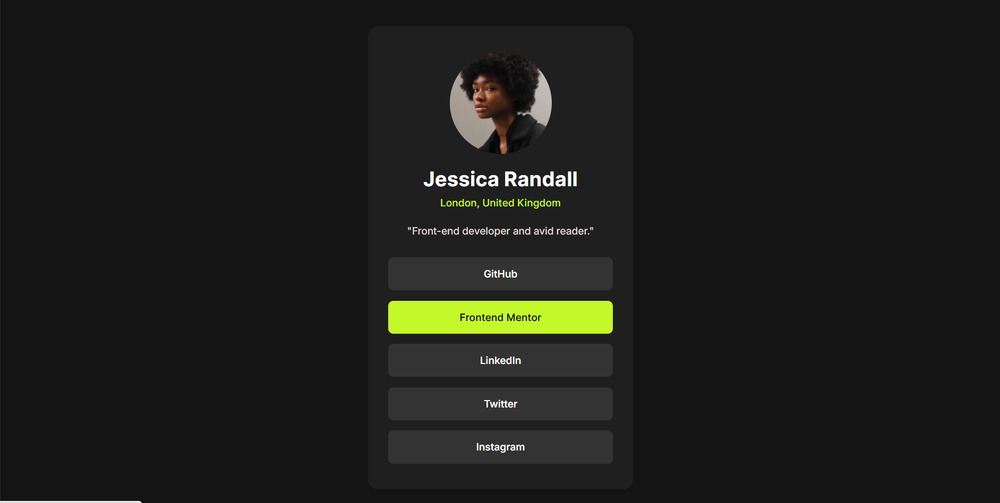
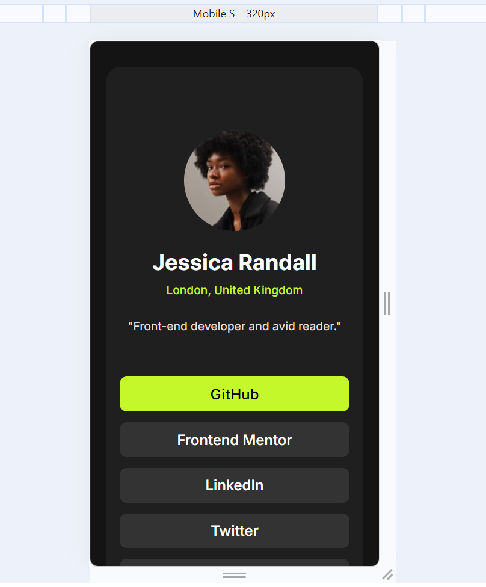

# Frontend Mentor - Social links profile solution

This is a solution to the [Social links profile challenge on Frontend Mentor](https://www.frontendmentor.io/challenges/social-links-profile-UG32l9m6dQ). 

## Table of contents

- [Overview](#overview)
  - [The challenge](#the-challenge)
  - [Screenshot](#screenshot)
  - [Links](#links)
- [My process](#my-process)
  - [Built with](#built-with)
  - [Continued development](#continued-development)
  - [Useful resources](#useful-resources)
- [Author](#author)
- [Acknowledgments](#acknowledgments)

## Overview

### The challenge

Users should be able to:

- See hover and focus states for all interactive elements on the page

### Screenshot

### Links

- Live Site URL: [Live Site](https://graycelaw.github.io/Frontend-Mentor-Projects/social-links-profile-main)

## My process

### Built with

- Semantic HTML5 markup
- CSS custom properties
- Flexbox
- Destop-first workflow

### Continued development

For future projects, I would love to challenge myself on positioning of elements using CSS. Also, on more flexbox layouts.

### Useful resources

- [Traversy Media](https://www.traversymedia.com/) - This helped me for flexbox layouts, especially understanding the main- and cross- axis for row and column direction.

## Author

- Frontend Mentor - [@graycelaw](https://www.frontendmentor.io/profile/graycelaw)
- Twitter - [@graycelaw_](https://www.twitter.com/graycelaw_)